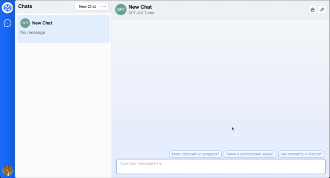

# llm-space: Large Language Models Space



An enterprise-level web UI for Large Language Models.

## Installation

1. Add a `.env` file to the root of the project with the following content:

```conf
OPENAI_API_KEY=sk-xxxxxxxxxxxxxxxxxxxxxxxxxxxxxxxxxxxxxxxx
```

> Note: You can get your own API key from [OpenAI](https://platform.openai.com/account/api-keys/).

2. **IMPORTANT:** Copy `packages/config.example.yaml` to `packages/config.yaml` and edit it as your needs.

```bash
cp packages/config.example.yaml packages/config.yaml
```

3. Install dependencies:

```bash
npm install
```

4. Start server:

Run in production mode:

```bash
npm run build
npm start
```

Or run in development mode:

```bash
npm run dev
```
